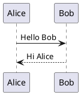

# Sample Markdown File 0

This is a sample Markdown file.

- Item 1
- Item 2
- Item 3

- [sample_1](sample_1.md) 
- [sample_2](sample_2.md)
- [google](https://google.com)

```php
use Illuminate\Pagination\Paginator;

public function boot()
{
    Paginator::useBootstrap();
}
```

- [mermaidサンプル](https://notepm.jp/help/mermaid)


